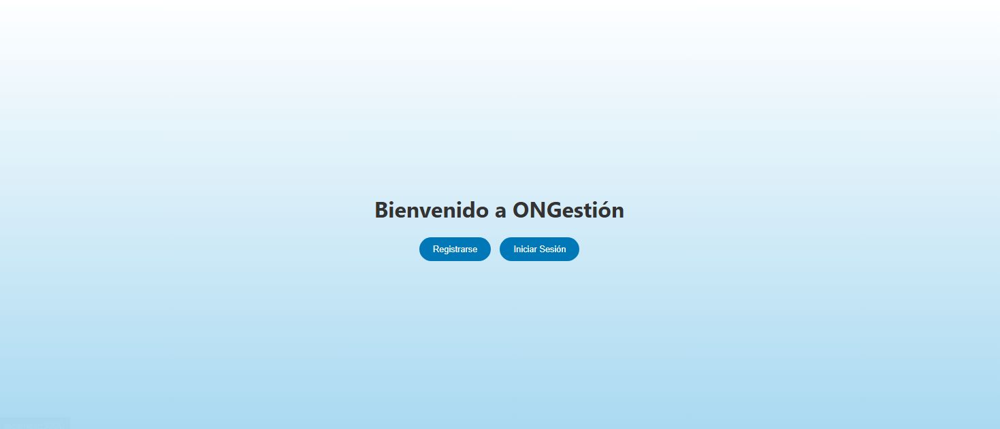

# ONGestión — Plataforma de Gestión Contable para ONGs

Este proyecto forma parte del Trabajo Final de Grado del Grado en Marketing. Se trata de una plataforma web desarrollada para facilitar la administración contable de ONGs, incluyendo la gestión de ingresos, gastos, facturas y generación de informes financieros.

---

## 🛠 Tecnologías utilizadas

- **Backend:** Spring Boot (Java)
- **Frontend:** React.js + Vite
- **Base de datos:** MySQL
- **ORM:** JPA / Hibernate
- **Estilo:** TailwindCSS
- **Otras librerías:** Axios, Lombok, React Router, shadcn/ui

---

## 📸 Captura de pantalla

  
*Pantalla inicial de la aplicación ONGestión, donde el usuario puede registrarse o iniciar sesión.*

---

## 🚀 Funcionalidades principales

- Gestión de ONGs y usuarios con diferentes roles
- Registro de ingresos y gastos
- Generación automática de facturas
- Descarga de facturas en PDF
- Creación de reportes financieros:  
  - Balance General  
  - Estado de Resultados  
- Filtros por fecha, ONG y tipo de reporte
- Seguridad en endpoints y gestión por roles (admin, finanzas, voluntario)

---

## 📦 Cómo ejecutar el proyecto

### 🔹 Backend (Spring Boot)

```bash
cd backend
./mvnw spring-boot:run
```

> Asegúrate de configurar tu `application.properties` con los datos de acceso a MySQL.

### 🔹 Frontend (React)

```bash
cd frontend
npm install
npm run dev
```

> La app estará disponible en `http://localhost:5173`.

---

## 📁 Estructura del repositorio

```
/backend
  └── src/main/java/com/tfg/ong/
      ├── controller/
      ├── model/
      ├── service/
      └── repository/

/frontend
  └── src/
      ├── components/
      ├── pages/
      ├── services/
      └── App.jsx
```

---

## 📄 Licencia

Este proyecto ha sido desarrollado con fines académicos como parte del Trabajo Final de Grado del Grado en Marketing en la Universidad CEU.
