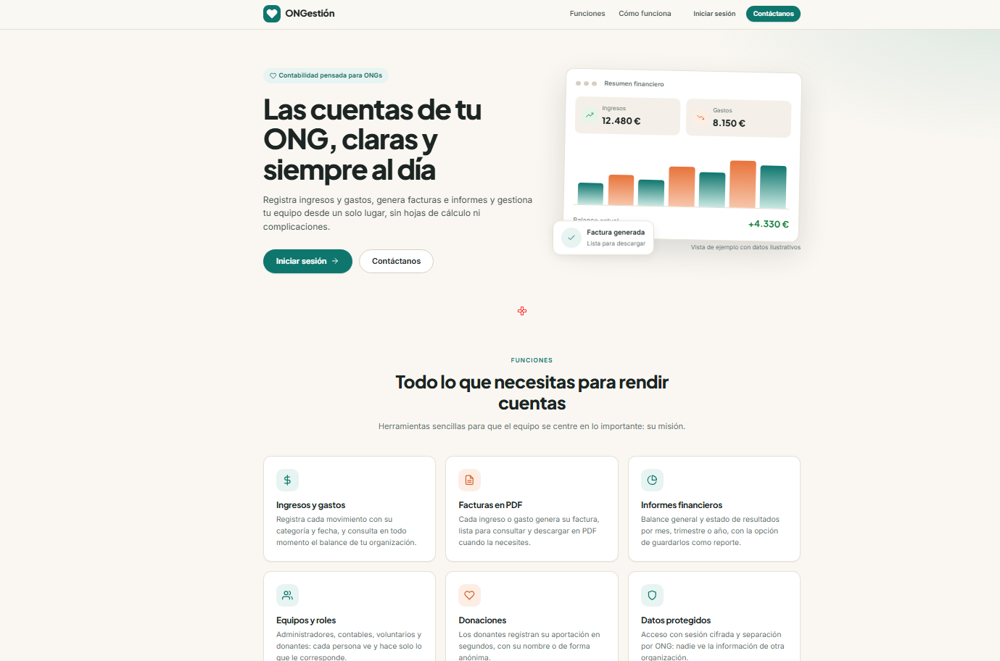

# ONGestión — Plataforma de Gestión Contable para ONGs

Este proyecto forma parte del Trabajo Final de Grado del Grado en Marketing. Se trata de una plataforma web desarrollada para facilitar la administración contable de ONGs: gestión de ingresos, gastos, facturas e informes financieros.

---

## 🛠 Tecnologías utilizadas

- **Backend:** Java 17 + Spring Boot 3 (Spring Web, Spring Data JPA, Spring Security)
- **Seguridad:** autenticación con JWT (sin sesión), contraseñas con BCrypt y control de acceso por rol y por ONG
- **Base de datos:** MySQL (ORM: JPA / Hibernate)
- **Frontend:** React 19 + React Router (proyecto Create React App)
- **Estilos:** CSS propio con variables de diseño (sin frameworks de UI)
- **Otras librerías:** Axios, jsPDF y html2canvas (facturas en PDF), springdoc-openapi (Swagger)
- **Pruebas:** JUnit 5, Mockito, Spring Security Test y JaCoCo

---

## 📸 Captura de pantalla

  
*Pantalla inicial de la aplicación ONGestión, donde el usuario puede registrarse o iniciar sesión.*

---

## 🚀 Funcionalidades principales

- Gestión de ONGs y de su equipo, con cuatro roles: **administrador**, **contable**, **voluntario** y **donante**
- Registro de ingresos y gastos
- Facturas generadas a partir de un ingreso o un gasto concreto (el importe y el número los fija el servidor)
- Descarga de facturas en PDF
- Informes financieros: Balance General y Estado de Resultados, por año
- Donaciones, que el donante puede hacer a su nombre o de forma anónima
- Seguridad: cada usuario solo ve y modifica los datos de su propia ONG, y cada rol solo accede a lo que le corresponde

| Rol | Qué puede hacer |
| --- | --- |
| Administrador | Todo en su ONG: editar la ONG, gestionar miembros, ingresos, gastos, facturas e informes |
| Contable | Registrar ingresos y gastos, generar facturas y consultar informes |
| Voluntario | Consultar los datos de su ONG |
| Donante | Hacer donaciones a la ONG |

---

## 📦 Cómo ejecutar el proyecto

### Requisitos

- Java 17 o superior
- Node.js 18 o superior
- MySQL 8

### 🔹 Base de datos

1. Crea la base de datos `tfg_ong` en MySQL.
2. Importa el volcado de ejemplo `tfg_db.sql` (incluye ONGs, usuarios, ingresos y gastos de prueba).
3. Revisa el usuario y la contraseña de MySQL en `ong/src/main/resources/application.properties` (por defecto `root` / `root`).

Hibernate actualiza las tablas al arrancar (`ddl-auto=update`), por lo que no hace falta ejecutar más scripts. Las contraseñas del volcado se convierten a BCrypt automáticamente en el primer arranque.

### 🔹 Backend (Spring Boot)

```bash
cd ong
./mvnw spring-boot:run
```

En Windows: `mvnw.cmd spring-boot:run`. El servidor queda en `http://localhost:8080` y la documentación de la API (Swagger) en `http://localhost:8080/swagger-ui.html`.

**Clave JWT.** Define la variable de entorno `JWT_SECRET` (mínimo 32 caracteres) antes de arrancar para que las sesiones sobrevivan a un reinicio:

```bash
# Linux / macOS
export JWT_SECRET="una-clave-larga-de-al-menos-32-caracteres"

# Windows (PowerShell)
$env:JWT_SECRET = "una-clave-larga-de-al-menos-32-caracteres"
```

Si no se define, se genera una clave aleatoria temporal en cada arranque (válido solo para desarrollo: al reiniciar hay que volver a iniciar sesión).

### 🔹 Frontend (React)

```bash
cd frontend
npm install
npm start
```

> La app estará disponible en `http://localhost:3000` y espera el backend en `http://localhost:8080`. Las tipografías se cargan desde Google Fonts, por lo que hace falta conexión a internet para verlas.

### 🔹 Pruebas

```bash
cd ong
./mvnw test
```

### 🔹 Probar la API con Postman

En la carpeta `PostManConfig` hay colecciones de Postman para cada recurso. Todas las rutas, salvo el login, necesitan un token:

1. Haz `POST http://localhost:8080/api/auth/login` con el cuerpo `{"email": "...", "password": "..."}`.
2. Copia el `token` de la respuesta.
3. En las demás peticiones, añade la cabecera `Authorization: Bearer <token>` (o usa la pestaña *Authorization → Bearer Token*).

---

## 📁 Estructura del repositorio

```
/ong                      Backend (Spring Boot)
  └── src/main/java/com/tfg/ong/
      ├── config/         Configuración (seguridad, CORS, Swagger)
      ├── controller/     Endpoints REST
      ├── dto/
      ├── exception/      Gestión global de errores
      ├── model/          Entidades JPA
      ├── repository/     Acceso a datos
      ├── security/       JWT, filtro de autenticación y control de acceso por ONG
      └── service/        Lógica de negocio
  └── src/test/           Pruebas unitarias y de seguridad

/frontend                 Frontend (React)
  └── src/
      ├── components/     Layouts, barra lateral, iconos, avisos y piezas comunes
      ├── pages/          Pantallas de la aplicación
      ├── services/       Autenticación (token y cabeceras de Axios)
      ├── styles/         Estilos de la aplicación
      └── utils/          Formato de importes, fechas, etc.

/PostManConfig            Colecciones de Postman
tfg_db.sql                Volcado de la base de datos de ejemplo
```

---

## 📄 Licencia

Este proyecto ha sido desarrollado con fines académicos como parte del Trabajo Final de Grado del Grado en Marketing en la Universidad CEU.
